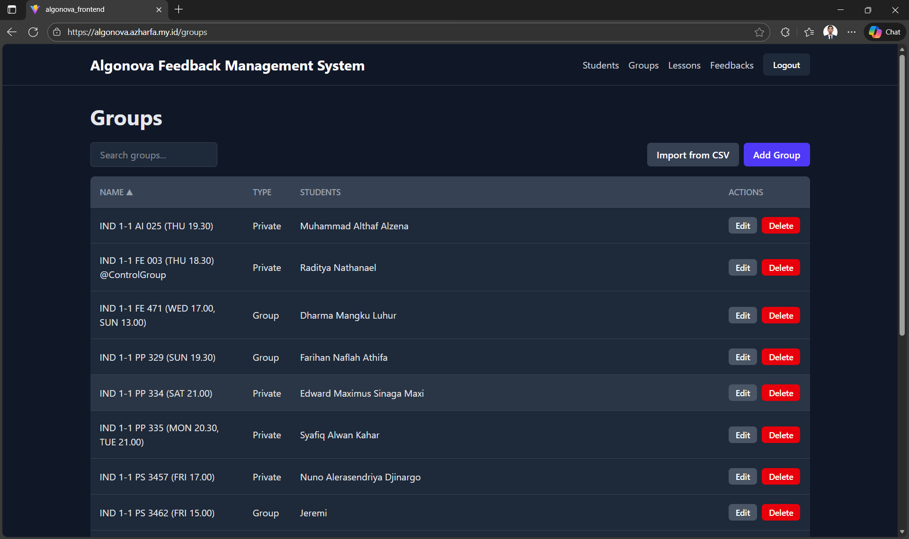
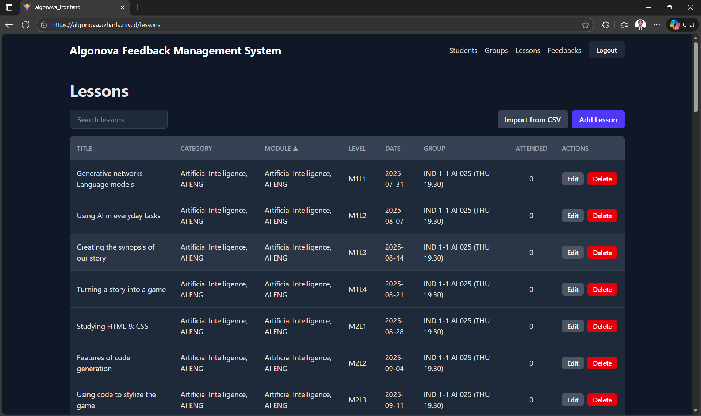
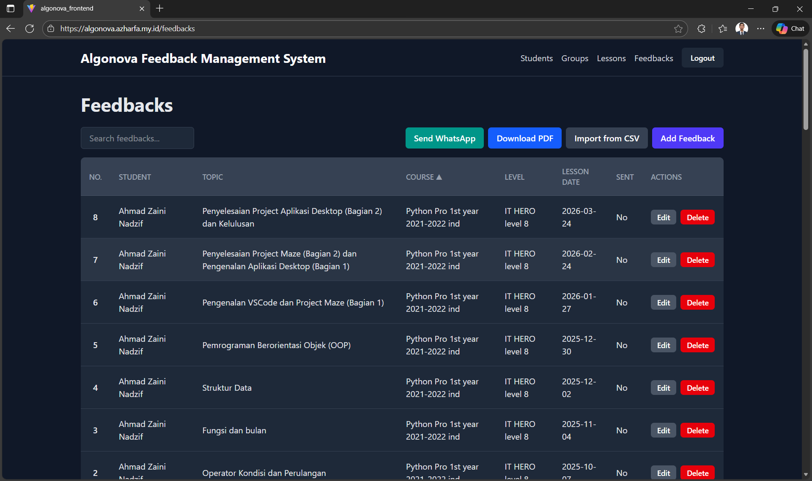
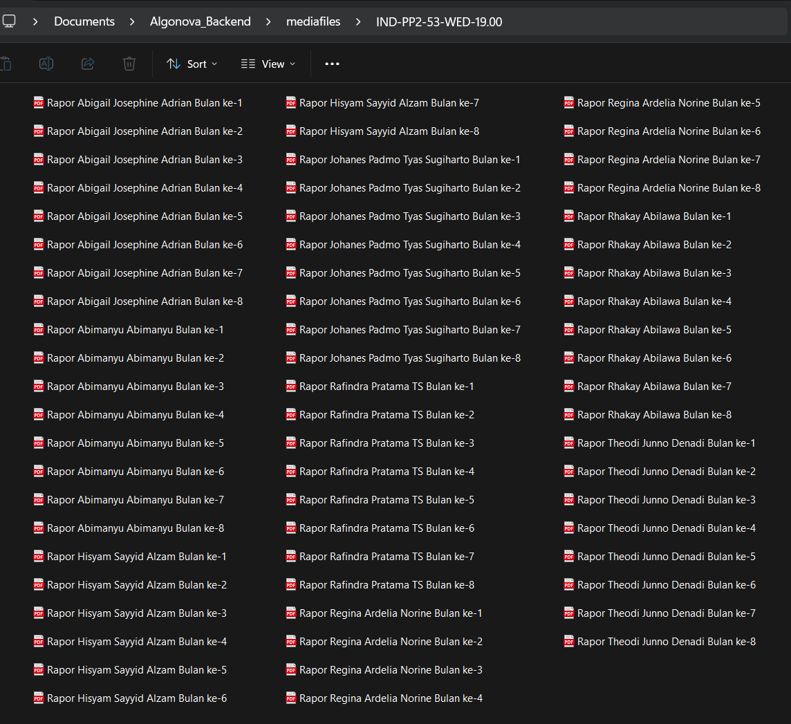
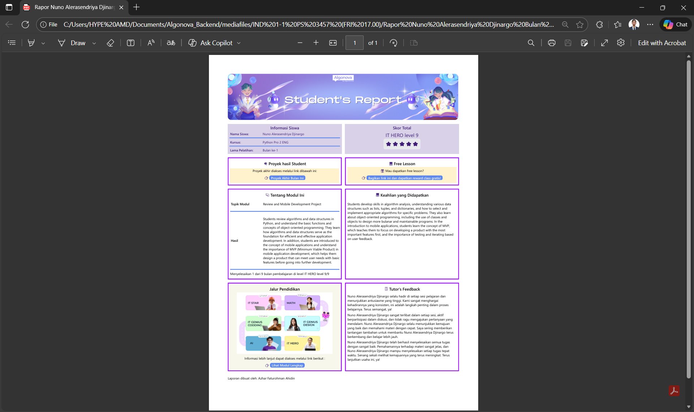

# Algonova Feedback Management System

Welcome to the Algonova Feedback Management System! This is a comprehensive frontend application built to streamline the process of managing feedback for students. It provides a user-friendly interface for administrators to handle students, groups, lessons, and their corresponding feedback records.

## ✨ Features

- **Secure Authentication**: A robust login system to protect administrative data.
- **Dashboard Landing Page**: A welcoming home page for new users.
- **Student Management**: Full CRUD (Create, Read, Update, Delete) functionality for student records.
- **Group Management**: Easily create, view, and manage student groups.
- **Lesson Management**: Organize and maintain lesson details.
- **Feedback Tracking**: A dedicated module for managing all student feedback.
- **Bulk CSV Import**: Quickly populate data for students, groups, and lessons using CSV files.
- **PDF Export**: Download feedback reports in PDF format.
- **Dynamic Search & Filtering**: Instantly search through records across all modules.
- **Infinite Scrolling**: Efficiently handle large datasets with on-demand loading.
- **Responsive UI**: A clean and modern interface built with Tailwind CSS, ensuring a great experience on any device.
- **Toast Notifications**: User-friendly feedback for actions like creation, updates, and deletions.

## 🚀 Getting Started

Follow these steps to get the development environment up and running on your local machine.

### Prerequisites

Make sure you have the following software installed:
- Node.js (v18.x or later recommended)
- npm or yarn

### Installation

1.  **Clone the repository:**
    ```sh
    git clone https://github.com/your-username/algonova-feedback-system.git
    cd algonova-feedback-system
    ```

2.  **Install dependencies:**
    ```sh
    npm install
    # or
    yarn install
    ```

3.  **Set up environment variables:**

    Create a `.env` file in the root of the project and add the URL for your backend API. This application expects the backend to be running separately.

    ```env
    VITE_API_BASE_URL=http://localhost:8000/api
    ```

4.  **Run the development server:**
    ```sh
    npm run dev
    ```
    The application will be available at `http://localhost:5173` (or another port if 5173 is busy).

### Building for Production

To create a production-ready build of the application, run:
```sh
npm run build
```
This command will generate a `dist` folder with the optimized static assets.

## 📂 Project Structure

The codebase is organized to be modular and scalable:

```
/src
├── /components    # Reusable UI components (forms, tables, modals)
├── /context       # React context for global state (e.g., Authentication)
├── /hooks         # Custom React hooks (e.g., useDebounce)
├── /pages         # Top-level page components for each route
├── /services      # API service modules for interacting with the backend
├── App.jsx        # Main application component with routing
├── main.jsx       # Entry point of the application
└── index.css      # Global styles and Tailwind CSS imports
```
## 📂 Project Structure









## 🤝 Contributing

Contributions are welcome! If you have suggestions for improvements or want to fix a bug, please feel free to:

1.  Fork the repository.
2.  Create a new branch (`git checkout -b feature/YourFeature`).
3.  Make your changes.
4.  Commit your changes (`git commit -m 'Add some feature'`).
5.  Push to the branch (`git push origin feature/YourFeature`).
6.  Open a Pull Request.

## 📝 License

This project is licensed under the MIT License. See the `LICENSE` file for details.
